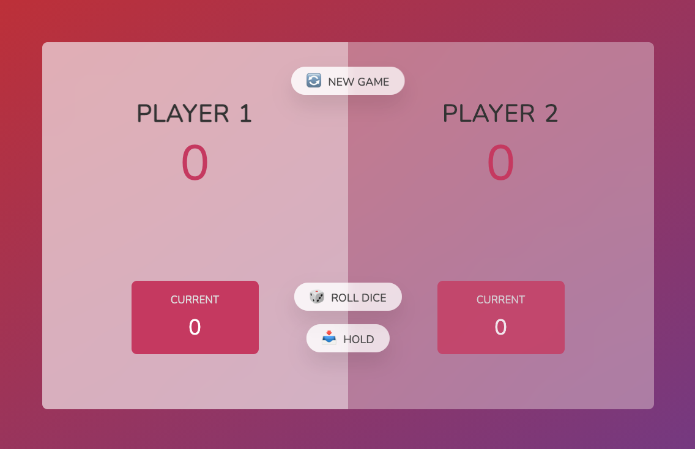

<h1>Pig Game</h1>
<h2>John Manouse</h2>

This is a game where you roll the die and hold your points when you are comfortable, because rolling a 1 removes your current roll total, and switches to the other player. The first player to reach 100 points wins! 

 

<h2>Fun Game Design</h2>
<ul>
    <li>HTML</li>
    <li>CSS</li>
    <li>Javascript</li>
</ul>

<h2>Pull Requests welcome for contribution</h2>

John Manouse

Live Link: <a href="https://mirageg4.github.io/pig-game/">Pig Game</a>

Github: <a href="https://github.com/Mirageg4/pig-game">Pig Game</a>

 

License: Project is licensed under the MIT License. 
See <a href ="LICENSE.md">LICENSE</a> file for details.
